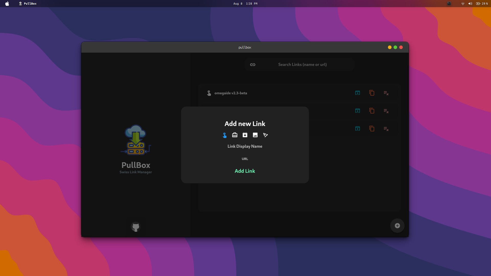

<div align="center">
    
    <h2>PullBox</h2>
    <h4>A swiss link manager for linux</h4>

<a href="https://github.com/vulpheonix/len/blob/main/LICENSE">
   	 
</a>

<a href="https://github.com/vulpheonix/len/graphs/contributors">
   	 
</a>

</div>



#  Installing
Get the executable from the release section.

#  Building from source
```shell
flutter build linux
```

##  Have an idea?
- Open up an issue
- Or fork the project and let that pull request rock! 😎


##  [Happy Hacking!!](https://github.com/omegaui)

